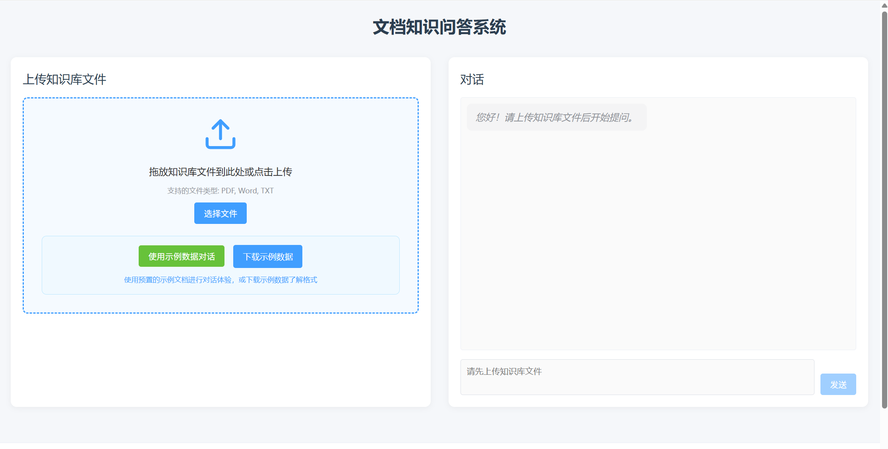
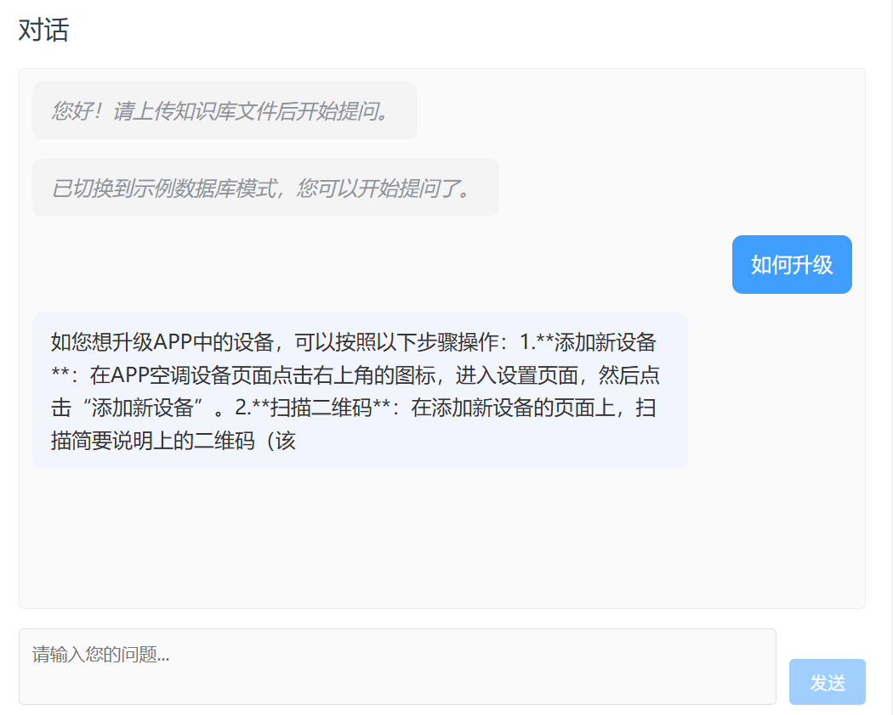
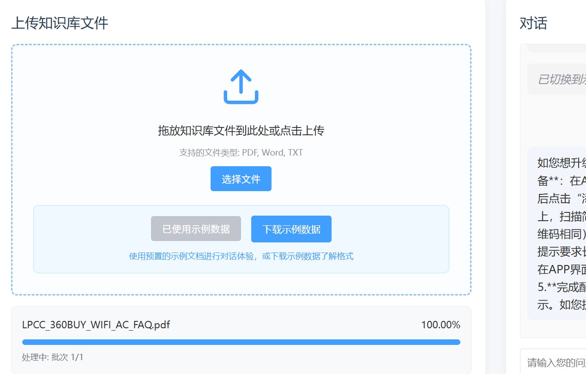
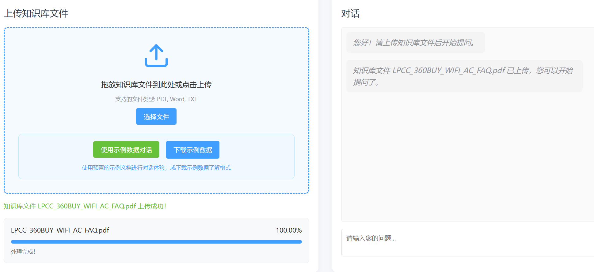

# 项目文档知识问答系统（KN-LLM）

项目介绍：
这是一个基于Qwen3模型的文档知识问答系统
主要功能是:
上传任意文档,提取文档中的文字,并将文字进行矢量化存储,
之后用户利用大模型进行问答,系统会根据用户的问题从文档中中提取相关文字作为上下文进行回答。
简而言之,就是基于RAG的大语言模型文档知识问答系统。

具体可以看说明文档:





环境：
请先安装docker环境
初次使用时，会自动下载模型文件到./model下
windows系统下可能运行后会在model中会有几个格式错误的文件,可能会影响运行,删除就行了下次就不会出现了

启动命令：
````
./build.sh
````
启动后访问：
http://localhost:81
演示地址：
http://chat.zhiwei3306.com

